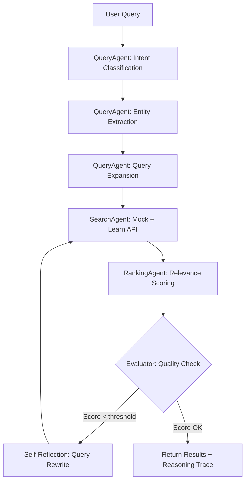

# TUB Viewer — Technology Update Briefing

[](https://github.com/00-massun-00/tub-viewer/actions/workflows/ci.yml)

> **A multilingual, multi-agent AI web app for tracking Microsoft technology updates across Azure, Dynamics 365, Microsoft 365, Power Platform, and Security — powered by Chain-of-Thought reasoning and MCP integration pipeline.**

Built with **GitHub Copilot** at [Agents League @ TechConnect](https://github.com/microsoft/agentsleague-techconnect) hackathon.


| Home Page                                                                                            | Search Results                                                                                                   | Export Menu                                                                                              |
| ---------------------------------------------------------------------------------------------------- | ---------------------------------------------------------------------------------------------------------------- | -------------------------------------------------------------------------------------------------------- |
|  |  |  |

---

## ✨ Features

### 🔍 Dual-Mode Navigation

- **Browse Mode** — Select a product from the sidebar to view categorized updates
- **Search Mode** — Natural language queries like "今月のアップデート情報教えて" or "Azure breaking changes"

### 🧠 Multi-step Query Processing Pipeline (Chain-of-Thought)

Queries are processed through a **5-step Chain-of-Thought reasoning pipeline** powered by GPT-4o:

1. **Intent Classification** — Classify query intent (browse / search / compare / summarize)
2. **Entity Extraction** — Extract products, period, severity, keywords via LLM
3. **Query Expansion** — Resolve abbreviations & ambiguity (e.g., "FO" → "Dynamics 365 Finance & Operations")
4. **Confidence Scoring** — Each extraction step includes a confidence score (0–1)
5. **Reasoning Summary** — Natural language explanation of why the analysis was chosen

When `OPENAI_API_KEY` is not configured, the system gracefully degrades to a rule-based NLP parser (Japanese + English) — ensuring the app always works.



### 🤖 Multi-Agent Architecture (Orchestrator-Workers Pattern)

The search pipeline uses a **multi-agent orchestrator** following Anthropic's "Building Effective Agents" guidance:

| Agent               | Responsibility                                                       | Pattern               |
| ------------------- | -------------------------------------------------------------------- | --------------------- |
| **QueryAgent**      | Query analysis via LLM Chain-of-Thought or rule-based fallback       | Single Responsibility |
| **SearchAgent**     | Parallel multi-source search (Mock Data + Learn API)                 | Parallelization       |
| **RankingAgent**    | Relevance scoring & re-ranking with keyword/recency/severity weights | Scoring Pipeline      |
| **EvaluatorAgent**  | Quality check + self-reflection query rewrite (max 1 retry)          | Evaluator-Optimizer   |
| **BriefingSummary** | AI-powered executive summary of results (LLM or rule-based)          | Summarization         |
| **Orchestrator**    | Coordinates all agents, manages pipeline flow                        | Orchestrator-Workers  |

Each agent has typed `Input`/`Output` interfaces, follows SRP (Single Responsibility Principle), and includes structured logging with request ID tracing.

### 🔄 Evaluation & Feedback Loop

The **EvaluatorAgent** implements a self-reflection loop:

- Assesses result quality using multi-factor scoring (result count × relevance × coverage)
- If quality falls below the configurable threshold (`EVALUATOR_THRESHOLD`):
  1. Requests a **query rewrite** from GPT-4o (Self-Reflection pattern)
  2. Re-parses and re-searches with the improved query
  3. Uses the better result set (original vs. improved)
- **Maximum 1 retry** to prevent infinite loops (Fail Fast principle)
- Evaluation results are included in the API response for transparency

### 📊 Reasoning Trace UI

Search results include a **collapsible Reasoning Trace panel** that visualizes:

- **Pipeline execution** — Each agent step with status badges and duration
- **Chain-of-Thought steps** — All 5 CoT reasoning steps with confidence bars
- **Data source breakdown** — Mock vs. Learn API result counts
- **Relevance metrics** — Average and top relevance scores with visual bars
- **Quality evaluation** — Pass/fail status and evaluation score
- **Request ID** — For end-to-end tracing and debugging

### ✨ AI Briefing Summary

After search results are ranked, the **BriefingSummaryAgent** generates an executive summary:

- LLM-powered (GPT-4o) locale-aware summary when API key is configured
- Rule-based fallback that counts breaking changes, new features, and improvements
- Displayed as a gradient card above the result list

### 🌐 8-Language Support

Japanese, English, Korean, Chinese, Spanish, French, German, Portuguese — all UI text dynamically switches.

### 📊 Smart Categorization

Updates are auto-classified into 3 severity levels:

- 🔴 **Breaking Changes / Retirements** — Immediate action required
- 🟡 **New Features / Changes** — Review recommended
- 🟢 **Improvements / Enhancements** — Informational

### 📤 Export to Excel & PowerPoint

- **Excel (.xlsx)** — 3-sheet workbook with summary, full update list (with filters & color-coding), and a dedicated Breaking Changes sheet
- **PowerPoint (.pptx)** — 16:9 presentation with title slide (stat cards), severity sections, and per-update detail cards

### 🔗 MCP Integration Pipeline (Model Context Protocol)

- **Microsoft Learn API** — Fetches real documentation updates from learn.microsoft.com via MCP integration pipeline
- Mock data from **Message Center** patterns (ready for WorkIQ MCP integration)
- Uses `@modelcontextprotocol/sdk` for MCP client connectivity
- **Retry with exponential backoff** — External API calls retry up to 2 times (1s, 2s delay)
- **Timeout protection** — 10-second AbortSignal timeout on all external calls

---

## 🏗️ Architecture

```
┌──────────────────────────────────────────────────────────────┐
│                        Next.js App                            │
│  ┌────────────┐  ┌────────────┐  ┌────────────┐             │
│  │ Product     │  │ Search     │  │ Export     │             │
│  │ Selector    │  │ Bar (NLP)  │  │ Button     │             │
│  └─────┬──────┘  └─────┬──────┘  └─────┬──────┘             │
│        │               │               │                      │
│  ┌─────▼───────────────▼───────────────▼──────────────────┐  │
│  │              API Routes (Zod-validated inputs)          │  │
│  │  /api/updates  /api/search  /api/learn  /api/export/*  │  │
│  └──────┬──────────────┬──────────────────────────────────┘  │
│         │              │                                      │
│  ┌──────▼──────────────▼──────────────────────────────────┐  │
│  │        Multi-Agent Orchestrator Pipeline                │  │
│  │  ┌──────────┐ ┌──────────┐ ┌──────────┐ ┌──────────┐ │  │
│  │  │ Query    │→│ Search   │→│ Ranking  │→│Evaluator │ │  │
│  │  │ Agent    │ │ Agent    │ │ Agent    │ │ Agent    │ │  │
│  │  │(CoT/NLP)│ │(parallel)│ │(scoring) │ │(reflect) │ │  │
│  │  └────┬─────┘ └────┬─────┘ └──────────┘ └────┬─────┘ │  │
│  │       │             │                          │        │  │
│  │  ┌────▼─────┐ ┌─────▼─────────┐  ┌────────────▼─────┐ │  │
│  │  │ GPT-4o   │ │ Mock Data     │  │ Self-Reflection  │ │  │
│  │  │ (OpenAI) │ │ + Learn API   │  │ (Query Rewrite)  │ │  │
│  │  └──────────┘ └───────────────┘  └──────────────────┘ │  │
│  └────────────────────────────────────────────────────────┘  │
│                                                               │
│  ┌───────────────────────────────────────────────────────┐   │
│  │ Cross-cutting: Structured Logger │ Config │ Validators│   │
│  └───────────────────────────────────────────────────────┘   │
└──────────────────────────────────────────────────────────────┘
```

---

## 🚀 Quick Start

```bash
# Clone
git clone https://github.com/<your-username>/tub-viewer.git
cd tub-viewer

# Install dependencies
npm install

# Configure environment (optional — app works without it)
cp .env.example .env
# Edit .env and add OPENAI_API_KEY for LLM reasoning

# Start dev server
npm run dev

# Open http://localhost:3000
```

### Prerequisites

- Node.js 18+
- npm 9+
- OpenAI API key (optional — enables Chain-of-Thought reasoning)

---

## ⚙️ Configuration (.env)

All configuration is managed via environment variables with sensible defaults. See `.env.example` for the full list.

| Variable               | Default  | Description                                   |
| ---------------------- | -------- | --------------------------------------------- |
| `OPENAI_API_KEY`       | —        | OpenAI API key for LLM reasoning pipeline     |
| `OPENAI_MODEL`         | `gpt-4o` | Model for Chain-of-Thought analysis           |
| `LEARN_API_TIMEOUT`    | `10000`  | Microsoft Learn API timeout (ms)              |
| `MAX_API_RETRIES`      | `2`      | Max retry attempts with exponential backoff   |
| `LOG_LEVEL`            | `info`   | Logging level: debug / info / warn / error    |
| `MAX_EXPORT_ITEMS`     | `500`    | Maximum items in export requests              |
| `ENABLE_LLM_REASONING` | `true`   | Enable/disable LLM pipeline                   |
| `EVALUATOR_THRESHOLD`  | `0.5`    | Quality threshold for self-reflection trigger |

Configuration is centralized in `src/lib/config.ts` with type-safe accessors, validation, and bounds checking.

---

## 🧪 Testing

Comprehensive test suite using **Vitest** with 84 test cases across 9 test files:

```bash
# Run all tests
npm test

# Run tests in watch mode
npm run test:watch

# Run with coverage report
npm run test:coverage
```

### Test Coverage

| Test File               | Cases | Covers                                                                |
| ----------------------- | ----- | --------------------------------------------------------------------- |
| `query-parser.test.ts`  | 20    | NLP parsing: products, periods, severity, sources, edge cases, search |
| `config-logger.test.ts` | 12    | Config defaults, env vars, bounds, singleton, logging output          |
| `validators.test.ts`    | 11    | Zod schemas: search, locale, period, URLSearchParams, error format    |
| `mcp-client.test.ts`    | 6     | Severity inference, UpdateItem mapping, date handling                 |
| `products.test.ts`      | 5     | Product master data integrity, uniqueness, family validation          |
| `ranking-agent.test.ts` | 9     | Relevance scoring, keyword/product/severity match, recency bonus      |
| `evaluator.test.ts`     | 8     | Quality assessment, pass/fail logic, score bounds, LLM fallback       |
| `orchestrator.test.ts`  | 8     | Pipeline coordination, agent output aggregation, reasoning trace      |
| `rate-limiter.test.ts`  | 5     | Sliding-window rate limiting, per-client tracking, default config     |

---

## 🔒 Security & Error Handling

### Security Headers

All responses include hardened HTTP headers via `next.config.ts`:

- `X-Content-Type-Options: nosniff`
- `X-Frame-Options: DENY`
- `X-XSS-Protection: 1; mode=block`
- `Referrer-Policy: strict-origin-when-cross-origin`
- `Permissions-Policy: camera=(), microphone=(), geolocation=()`

### Input Validation (Zod)

All API endpoints validate inputs using Zod schemas:

- Query length limits (max 500 characters)
- Locale whitelist (8 supported languages)
- Period enum validation
- Export item count limits
- Structured error responses with field-level details

### Error Handling & Resilience

- **React Error Boundary** — Catches rendering crashes and displays a friendly fallback UI with retry button
- **API Rate Limiting** — Sliding-window rate limiter (30 req/min per IP) on search API with 429 responses and Retry-After headers
- **Retry with exponential backoff** — External API calls retry up to 2 times (1s → 2s)
- **Graceful degradation** — LLM unavailable → rule-based fallback; Learn API fails → mock data only
- **Timeout protection** — 10-second AbortSignal on all external calls
- **No internal error leakage** — Error responses return safe messages, never raw stack traces
- **MCP client cleanup** — Proper connection teardown via `closeMcpClients()`

---

## 📊 Logging & Observability

Structured JSON logging via `src/lib/logger.ts`:

```json
{
  "timestamp": "2026-02-14T01:00:00.000Z",
  "level": "info",
  "component": "Orchestrator",
  "message": "Multi-agent orchestrator completed",
  "requestId": "req_1707868800_a1b2c3",
  "durationMs": 1234,
  "data": { "resultCount": 15, "pipelineSteps": 4 }
}
```

Features:

- **Log levels**: debug / info / warn / error (configurable via `LOG_LEVEL`)
- **Request ID tracing**: Unique ID per request for end-to-end correlation
- **Performance measurement**: `withTiming()` utility for async operation profiling
- **Component-scoped**: Each module has its own named logger instance

---

## 🛠️ Tech Stack

| Layer             | Technology                |
| ----------------- | ------------------------- |
| Framework         | Next.js 16 (App Router)   |
| Language          | TypeScript (strict mode)  |
| Styling           | Tailwind CSS 4            |
| MCP SDK           | @modelcontextprotocol/sdk |
| LLM               | OpenAI GPT-4o             |
| Validation        | Zod                       |
| Testing           | Vitest + V8 Coverage      |
| Excel Export      | ExcelJS                   |
| PowerPoint Export | PptxGenJS                 |
| Icons             | Lucide React              |

---

## 📂 Project Structure

```
src/
├── app/
│   ├── api/
│   │   ├── products/route.ts     # Product master data
│   │   ├── updates/route.ts      # Updates (mock + Learn MCP) with period filter
│   │   ├── search/route.ts       # Multi-agent orchestrated search
│   │   ├── learn/route.ts        # Microsoft Learn MCP integration
│   │   └── export/
│   │       ├── excel/route.ts    # Excel export
│   │       └── pptx/route.ts     # PowerPoint export
│   ├── layout.tsx
│   └── page.tsx                  # Main page (browse/search modes)
├── components/
│   ├── ProductSelector.tsx       # Accordion product list
│   ├── UpdateCard.tsx            # Severity-coded update card
│   ├── UpdateList.tsx            # Grouped update display
│   ├── SearchBar.tsx             # NLP search with suggestions (a11y + keyboard shortcuts: / to focus, Esc to clear)
│   ├── ExportButton.tsx          # Excel/PPTX dropdown (a11y: role=menu)
│   ├── ReasoningTrace.tsx        # Pipeline visualization + CoT steps + evaluation
│   ├── ErrorBoundary.tsx         # React error boundary with friendly fallback
│   ├── SkeletonLoader.tsx        # Loading skeleton for update cards
│   ├── LanguageSelector.tsx      # 8-language switcher
│   └── PeriodSelector.tsx        # Time range filter
└── lib/
    ├── agents/
    │   ├── orchestrator.ts       # Multi-agent pipeline coordinator
    │   ├── query-agent.ts        # Query analysis (LLM CoT + rule-based)
    │   ├── search-agent.ts       # Parallel multi-source search
    │   ├── ranking-agent.ts      # Relevance scoring & re-ranking
    │   └── evaluator.ts          # Quality check & self-reflection│   │   └── briefing-summary.ts   # AI executive summary (LLM + fallback)    ├── __tests__/
    │   ├── query-parser.test.ts  # 20 test cases
    │   ├── config-logger.test.ts # 12 test cases
    │   ├── validators.test.ts    # 11 test cases
    │   ├── mcp-client.test.ts    # 6 test cases
│   │   ├── products.test.ts      # 5 test cases
│   │   ├── ranking-agent.test.ts # 9 test cases
│   │   ├── evaluator.test.ts     # 8 test cases
│   │   ├── orchestrator.test.ts  # 8 test cases
│   │   └── rate-limiter.test.ts  # 5 test cases
    ├── rate-limiter.ts           # Sliding-window rate limiter
    ├── llm-query-analyzer.ts     # GPT-4o Chain-of-Thought engine
    ├── config.ts                 # Centralized env var management
    ├── logger.ts                 # Structured JSON logging
    ├── validators.ts             # Zod input validation schemas
    ├── types.ts                  # Types + i18n text (8 languages)
    ├── products.ts               # 21 products, 6 families
    ├── mock-data.ts              # Realistic MC-style data
    ├── query-parser.ts           # Rule-based NLP (fallback)
    └── mcp-client.ts             # MCP client with retry & timeout
```

---

## 🤖 GitHub Copilot Usage

This entire project was built using **GitHub Copilot in Agent Mode** within VS Code:

1. **Architecture design** — Copilot designed the multi-agent pipeline, component structure, and data flow
2. **Code generation** — All TypeScript/React components generated via Copilot
3. **MCP integration** — Copilot configured MCP SDK client and Microsoft Learn API connection
4. **Multi-agent system** — Orchestrator-Workers pattern implemented with Copilot guidance
5. **LLM integration** — Chain-of-Thought reasoning pipeline designed and built with Copilot
6. **NLP implementation** — Query parser with Japanese/English NLP built with Copilot assistance
7. **Testing** — 84 unit tests across 9 test files generated with Copilot
8. **Export features** — ExcelJS and PptxGenJS document generation coded by Copilot
9. **Error handling** — Retry mechanisms, Zod validation, structured logging added by Copilot
10. **i18n** — 8-language UI text generated and maintained by Copilot

---

## 🎯 Hackathon Track

**Track 1: 🎨 Creative Apps — GitHub Copilot**

| Criteria                            | How This Project Addresses It                                                               |
| ----------------------------------- | ------------------------------------------------------------------------------------------- |
| **Accuracy & Relevance**            | Real-time Learn API + date-filtered results + relevance scoring + reasoning trace UI        |
| **Reasoning & Multi-step Thinking** | 5-step Chain-of-Thought, multi-agent orchestration, evaluator-optimizer loop, visible in UI |
| **Creativity & Originality**        | AI Briefing Summary, Reasoning Trace visualization, multi-lingual TUB viewer                |
| **UX & Presentation**               | Polished UI, skeleton loader, keyboard shortcuts, a11y (ARIA), reasoning panel            |
| **Reliability & Safety**            | 84 tests, Zod validation, rate limiting, error boundary, security headers, logging, retry |
| **MCP Integration**                 | Microsoft Learn API via MCP integration pipeline; ready for WorkIQ                          |

---

## 📜 Disclaimer

This project was created during the Agents League @ TechConnect hackathon.
See [DISCLAIMER.md](https://github.com/microsoft/agentsleague-techconnect/blob/main/DISCLAIMER.md) and [CODE_OF_CONDUCT.md](https://github.com/microsoft/agentsleague-techconnect/blob/main/CODE_OF_CONDUCT.md).

---

## 📄 License

MIT
